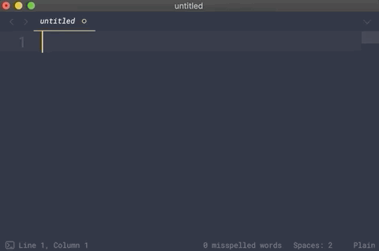

# plop (working title)
_Scriptable text expansion microtool._

`Status: pre-alpha / prototype / I thought of this an hour ago`





## Usage:

```
# Only works on MacOS for now.
git clone https://github.com/rileyjshaw/plop
cd plop
npm i
npm start
```

While going about your business, hit `Cmd + Shift + Space`. Write some valid
JavaScript. The result will be typed into whatever program you have open.

### Note:

`\n` triggers a simulated Enter press. Please be kind, don't spam your group
chat.
